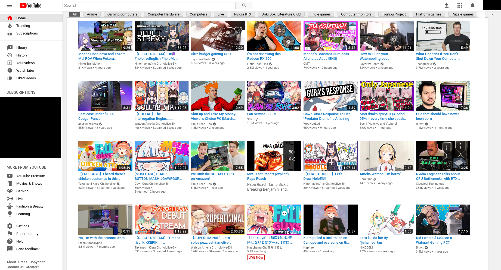
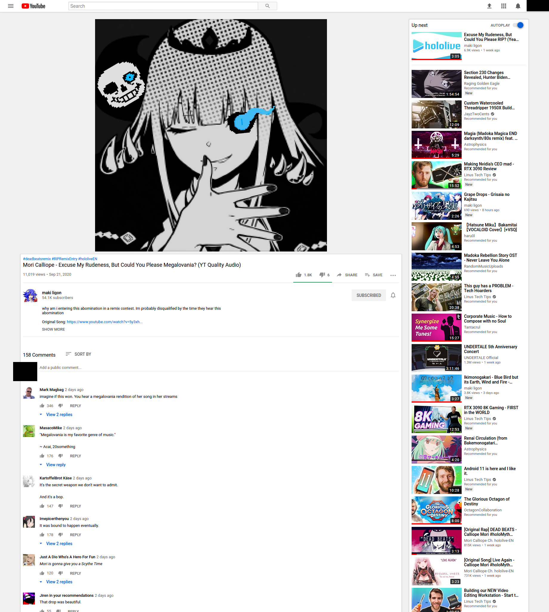

# Improved Polymer YouTube

Stylesheet to make YouTube look more like it's old design. Lots of dirty hacks.
Most of the changes are to the search bar, sidebar, home page, and video page.
Other pages may be affected as well, or even completely broken, YMMV.

* Videos on the home screen are now much smaller
* Video titles are blue, and have the hover underline, like they used to
* Added card-shaped boxes around a lot of things.
* Removed a ton of whitespace around everything
* Some other stuff

This stylesheet won't change anything about how the video player renders,
because it hasn't really changed much in any objectionable way. The only major
difference is that it changes shape instead of showing black bars, and I
actually like that feature, so it stays in.

## Installation Instructions

1. Install Stylus [Firefox](https://addons.mozilla.org/en-US/firefox/addon/styl-us/) [Chrome](https://chrome.google.com/webstore/detail/stylus/clngdbkpkpeebahjckkjfobafhncgmne)
2. Copy [improved-polymer-youtube.user.css](improved-polymer-youtube.user.css)
3. Go to youtube, click the Stylus icon, and choose create style for youtube
   (doesn't matter what part you click).
4. Click import, paste the contents of that file. Overwrite.
6. Add [releases.atom](../../releases.atom) to your feed reader so when YouTube breaks
   this stylesheet you'll get notified if I fix it.

## Screenshots

Home Page: 

Video Page:

